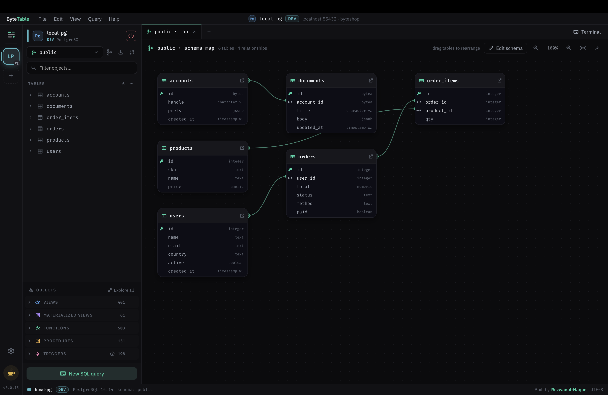
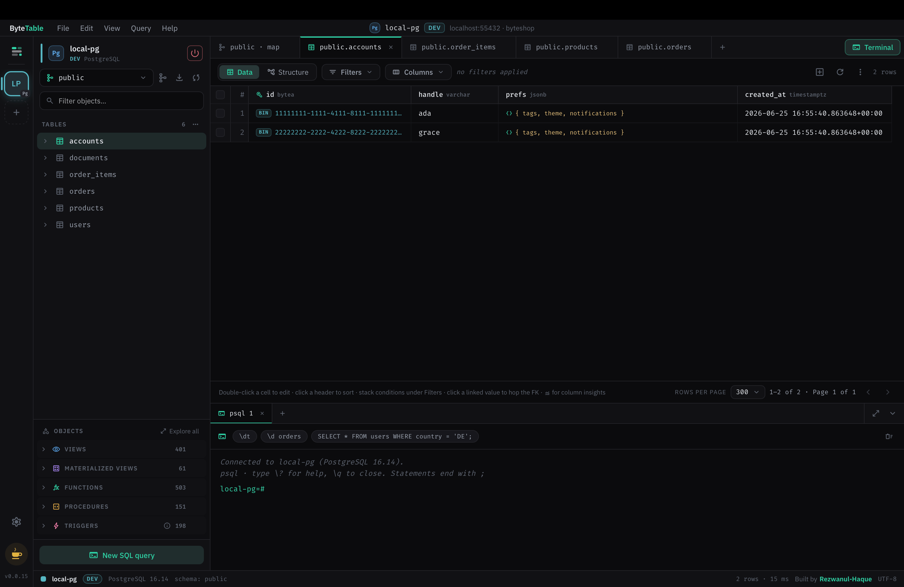

# ByteTable

A free, open-source, **local-first desktop database client** — a TablePlus / BeekeeperStudio
like tool with first-class Linux, MacOS, Windows support, no pro tier, and no subscription. One window, Multiple workspace, eight engines:
**SQLite · MySQL · PostgreSQL · SQL Server · Redis · DynamoDB · MongoDB · Cassandra**. Many more engines to come.




Your credentials never leave your machine: all database I/O happens in the Rust core, secrets live
in the OS keychain, and the renderer only ever sees opaque connection ids.

## Table of contents

- [Features](#features)
- [Tech stack](#tech-stack)
- [Prerequisites](#prerequisites)
- [Run it (dev mode)](#run-it-dev-mode)
- [Common commands (Makefile)](#common-commands-makefile)
- [Try it against real databases](#try-it-against-real-databases)
- [Project layout](#project-layout)
- [Install](#install)
- [Building a distributable](#building-a-distributable)
- [Contributing](#contributing)
- [License & funding](#license--funding)

## Features

**Workspaces** — multiple simultaneous connections as colored, renamable tiles in a left rail,
each with its own tab set and sidebar state.

**SQL engines (SQLite / MySQL / PostgreSQL / SQL Server)**

- Virtualized data grid: type-aware cells, sort, server-side paging (rows-per-page footer), inline cell editing (parameterized `UPDATE`, production-confirm).
- Stackable filter builder (13 operators, parameterized) + raw `WHERE` escape hatch.
- SQL editor: syntax highlighting, `⌘↩` run, per-tab history, **global saved queries** (optionally scoped to a workspace), and an **Explain** panel + execution-order minimap.
- Structure view: columns / indexes / foreign keys / referenced-by / DDL, with inline editing staged into reviewable `ALTER` statements (apply/discard).
- **FK hop** (peek a referenced row → open it filtered), **column insights** (distinct/nulls/min/max/avg + top-5 over the current filter).
- **Schema map**: draggable ER diagram with movable FK edges, zoom, and PNG/SVG export.
- **Export** a table or schema to CSV / SQL; **truncate** with a confirm dialog.
- **SQL Server** plugs into the same relational surface as a fourth engine — T-SQL dialect throughout (bracket-quoted identifiers, `OFFSET…FETCH` paging, `IDENTITY`, the `sys.*` catalog, `dbo` default schema, indexed views in place of materialized views) and a `sqlcmd` terminal. Backed by the `tiberius` TDS driver.

**Redis** — a purpose-built keyspace browser (not shoehorned into a grid): db0–db15 switcher, `SCAN`-based key list (tree + flat), type-aware viewers/editors for string/hash/list/set/zset/stream, key TTL/encoding/memory info, and a keyspace dashboard.

**DynamoDB** — its own document/single-table-design surface (not forced into a relational grid): table list with key schema + GSI/LSI preview, scan/query with sort-key operators, attribute-union item grid + JSON item editor, a `DescribeTable`-driven dashboard, PartiQL console, a single-table-design schema map (with PNG/SVG export), and CSV / JSON export & import.

**MongoDB** — a document/collection surface: database selector + collection list with index sub-rows, the Find tab (filter / projection / sort / limit) with Tree ⇄ Table views, a JSON document editor with `$jsonSchema` validation, an aggregation-pipeline builder (inline + standalone, incl. `$lookup`), a real `explain("executionStats")` panel, an inferred-schema / Indexes / Validation Structure tab, a `mongosh` console, a collection schema map (with PNG/SVG export), and JSON / mongosh-script / CSV export & import. BSON `ObjectId` / `ISODate` survive read → edit → write.

**Cassandra** — a query-first wide-column surface (not forced into a relational grid): keyspace selector + table list, a CQL-correct query builder (partition / clustering / non-key predicates with an explicit `ALLOW FILTERING` opt-in), per-query consistency level, hybrid inline editing (regular scalars inline, complex types in a row modal, key columns locked), a Structure tab with secondary indexes / materialized views, a standalone CQL query tab + `cqlsh` terminal (incl. `nodetool status`), a denormalization schema map (with PNG/SVG export), create-keyspace / create-table flows, and CQL / CSV / JSON export & import. CQL types (`uuid` / `timeuuid` / `timestamp` / collections) survive read → edit → write.

**Settings** — a tabbed preferences modal (`⌘,`): 12 themes (incl. light), accent + font (editor mono + UI) + size + density, and behavior toggles (ligatures, reduce-motion, row-hover, default row limit, production-write confirm). Applied app-wide via CSS variables; persisted locally (localStorage + an editable on-disk mirror).

**Shared** — a VS Code-style **docked terminal panel** (per-engine REPL: psql/mysql/sqlite3-style for SQL, `sqlcmd` for SQL Server, redis-cli for Redis, mongosh for MongoDB, `cqlsh` for Cassandra; PartiQL for DynamoDB; `Ctrl+\``), command palette (`⌘K`), system tray, and live theming via the Settings modal.

## Tech stack

- **Shell:** Rust + **Tauri 2** (small binaries; macOS / Linux / Windows).
- **UI:** React + TypeScript + Vite in the Tauri webview.
- **Architecture:** vertical-slice + clean architecture — one feature per capability
  (`connections`, `introspection`, `browse`, `query`, `structure`, `mutate`, `export`, `keyvalue`,
  `dynamo`, `mongo`, `cassandra`, `schema_map`, `insights`, `preferences`, `settings`), each with
  domain / application / ports / infrastructure / thin Tauri-command layers. Engine drivers
  (`rusqlite`, `sqlx`, `tiberius`, `redis`, `aws-sdk-dynamodb`, `mongodb`, `scylla`) are infrastructure adapters
  behind shared port traits (a separate port family per data model: SQL, key-value,
  DynamoDB-document, MongoDB, and Cassandra wide-column).

## Prerequisites

- **Rust** ≥ 1.77 (stable toolchain via [rustup](https://rustup.rs)). _Optional:_ the `make`
  targets auto-install it for you if `cargo` is missing (see the note below).
- **Node** ≥ 18 and **pnpm** 10 (`corepack enable` or `npm i -g pnpm`).
- **Tauri 2 system deps** — see the [Tauri prerequisites guide](https://tauri.app/start/prerequisites/).
  On Linux that means WebKitGTK 4.1 + build essentials; macOS needs Xcode command-line tools.
- **Docker** (optional) — only to run the bundled test databases (see below).

> **Auto-install:** `make build`/`dev`/`test`/`lint`/`fmt` run `pnpm install` first, and an
> `ensure-cargo` step that installs the Rust toolchain via the official [rustup](https://rustup.rs)
> script (`-y --no-modify-path`) **when `cargo` is not already on your PATH** — so a fresh machine
> can build with one command. It is a no-op once Rust is installed. This runs a network install of a
> toolchain on your machine; if you'd rather control that, install Rust yourself first (then the step
> just skips), or run the underlying `pnpm`/`cargo` commands directly. Auto-install covers
> Linux/macOS/BSD and Git-Bash/MSYS on Windows; native Windows `cmd`/PowerShell users install Rust
> manually from [rustup.rs](https://rustup.rs). (`curl` is required for the auto-install.)

## Run it (dev mode)

```sh
git clone git@github.com:Rezwanul-Haque/byteTable.git && cd byteTable
pnpm install        # or: make install
make dev            # or: pnpm tauri dev
```

`make dev` launches the Vite dev server and the Tauri window together with hot reload. First run
compiles the Rust core, so it takes a few minutes; subsequent runs are fast.

## Common commands (Makefile)

| Command                         | What it does                                                               |
| ------------------------------- | -------------------------------------------------------------------------- |
| `make dev`                      | Run the app in development (Tauri + Vite, hot reload)                      |
| `make test`                     | Rust unit + integration tests + TS typecheck                               |
| `make lint`                     | ESLint + Prettier check + `cargo fmt --check` + `cargo clippy -D warnings` |
| `make fmt`                      | Auto-format (Prettier + rustfmt)                                           |
| `make build`                    | Production desktop bundle (`tauri build`)                                  |
| `make build-debug` / `make run` | Fast debug build / build-then-launch                                       |
| `make db-up` / `make db-down`   | Start+seed / wipe the test databases                                       |
| `make`                          | List all targets                                                           |

(Each maps to the underlying `pnpm` / `cargo` command — run those directly if you prefer.)

## Try it against real databases

A ready-to-use set of throwaway databases lives in [`test-fixtures/`](test-fixtures/):

```sh
make db-up          # Postgres + MySQL + SQL Server + Redis + DynamoDB + MongoDB + Cassandra (seeded) on offset ports
```

Then in the app's **New connection** modal (TLS: disable), use the credentials in
[`test-fixtures/README.md`](test-fixtures/README.md) — e.g. Postgres `localhost:55432`,
user `postgres`, password `bytetable`, database `byteshop`. SQL Server is
`localhost:11433`, user `sa`, password `ByteTable1!`, database `byteshop`. For
SQLite, choose **"Open SQLite file…"** → `test-fixtures/byteshop.db`. Stop them
with `make db-down`.

To exercise the **SSH tunnel** feature, `make tunnel-up` starts a bastion with
MySQL/PostgreSQL/Redis reachable only through it — see
[`docs/SSH_TUNNEL_TESTING.md`](docs/SSH_TUNNEL_TESTING.md).

## Project layout

```
src/                     Renderer (React/TS), one folder per feature
  features/<feature>/    components / state (Zustand) / api (typed invoke wrappers)
  shared/                design tokens, UI primitives, wire types
src-tauri/               Rust core
  src/engines/           engine adapters (sqlite, postgres, mysql, mssql, redis, dynamo, mongo, cassandra, ssh tunnel)
  src/features/<slice>/  domain / application / ports / infrastructure / commands
  src/shared/            error type, engine + key-value + document + mongo + wide-column port traits
test-fixtures/           docker-compose + seeds + sample SQLite
docs/                    design specs
```

## Install

**macOS / Linux** — one line; it detects your OS/arch and installs the latest release:

```sh
curl -fsSL https://raw.githubusercontent.com/rezwanul-Haque/byteTable/main/install.sh | sh
```

- **macOS** mounts the `.dmg` and copies `ByteTable.app` to `/Applications` (and clears the
  Gatekeeper quarantine flag, since the build isn't notarized yet).
- **Linux**
  - **Debian / Ubuntu** → installs the `.deb` via `apt` (app-menu entry + dependency resolution;
    needs `sudo`). This is preferred because AppImages need `libfuse2`, which Ubuntu 22.04+ no
    longer ships, so they often won't launch.
  - **Other distros** (or no matching `.deb` in the release) → drops the `.AppImage` into
    `~/.local/bin/bytetable` (no `sudo`); if it won't run, `sudo apt install libfuse2`.

**Windows** — in PowerShell:

```powershell
irm https://raw.githubusercontent.com/rezwanul-Haque/byteTable/main/install.ps1 | iex
```

It downloads the latest installer and runs it (or grab the `.exe` directly from the
[latest release](https://github.com/rezwanul-Haque/byteTable/releases/latest)).

> Prefer not to pipe to a shell? Read [`install.sh`](install.sh) / [`install.ps1`](install.ps1)
> first, or just download the installer for your OS from the releases page. The scripts need a
> published release to exist.

## Building a distributable

`make build` (= `pnpm tauri build`) produces installers for the **OS you run it on** — Tauri
builds natively per platform, so build each target on that OS (or in CI). Output lands in
`src-tauri/target/release/bundle/`.

### macOS

```sh
make build                                   # → bundle/macos/ByteTable.app + bundle/dmg/*.dmg
# Apple-silicon + Intel universal binary:
rustup target add aarch64-apple-darwin x86_64-apple-darwin
pnpm tauri build --target universal-apple-darwin
```

Requires Xcode command-line tools. Distributing outside your own machine needs **code signing +
notarization** (an Apple Developer ID); set `APPLE_CERTIFICATE`, `APPLE_ID`, `APPLE_PASSWORD`,
`APPLE_TEAM_ID` env vars and Tauri signs/notarizes during the build. Unsigned `.app`s run locally
but Gatekeeper blocks them elsewhere.

### Linux

```sh
make build          # → bundle/deb/*.deb + bundle/appimage/*.AppImage  (+ bundle/rpm/*.rpm)
```

Install the Tauri 2 Linux deps first (Debian/Ubuntu):

```sh
sudo apt install libwebkit2gtk-4.1-dev libgtk-3-dev libayatana-appindicator3-dev \
                 librsvg2-dev build-essential curl wget file
```

`.deb`/`.rpm` are tied to the building distro's libraries; the **`.AppImage`** is the most
portable single-file artifact. Build on the oldest distro you intend to support (glibc
compatibility is forward, not backward).

#### Installing the build on Linux

- **`.AppImage`** — no install. Make it executable and run it:
  ```sh
  chmod +x ByteTable_*.AppImage
  ./ByteTable_*.AppImage
  ```
- **`.deb`** (Debian/Ubuntu) — **install from a terminal:**
  ```sh
  sudo apt install ./bytetable_*_amd64.deb     # resolves dependencies
  # or:
  sudo dpkg -i ./bytetable_*_amd64.deb && sudo apt -f install
  ```
  Then launch from your app menu or run `bytetable`.
  > ⚠️ **Don't double-click the `.deb`.** On Ubuntu 22.04+ that opens it in the snap-based
  > "App Center", which **cannot install local `.deb` files** — it appears to do nothing. This is an
  > Ubuntu limitation, not a problem with the package; use the `apt install ./…` command above.
- **`.rpm`** (Fedora/RHEL/openSUSE) — `sudo dnf install ./bytetable-*.rpm` (or `sudo zypper install`).

#### App icon in the dock / taskbar

Unlike macOS (where the `.app` bundle carries the icon and the Dock reads it directly), Linux
docks resolve an icon by matching the running **window** — its `app_id` (Wayland) or `WM_CLASS`
(X11) — to an **installed `.desktop` entry**, then showing that entry's `Icon=`.

- **A raw `.AppImage` installs nothing**, so there is no `.desktop` to match → the dock shows a
  generic icon. Either **install the `.deb`/`.rpm`** (they install the `.desktop` + hicolor icons,
  so the icon appears in the dock and app menu), or integrate the AppImage with
  [AppImageLauncher](https://github.com/TheAssassin/AppImageLauncher) / **Gear Lever** ("Add to
  menu"), which creates the `.desktop` + extracts the icon.
- **GNOME on Wayland** maps a window to its launcher — for both the icon **and the running-window
  dot** — by matching the window's `app_id` to a `.desktop` **file name** (it largely ignores
  `StartupWMClass`). The catch: GNOME **lowercases** the `app_id` before looking up
  `<app_id>.desktop`. The window's class is the **binary name**, not the bundle identifier
  (`com.bytetable.app` is macOS/updater-only) — so a capitalized binary like `ByteTable` reports
  `ByteTable`, GNOME searches `bytetable.desktop`, and a `ByteTable.desktop` entry never matches →
  generic icon **and no running dot**. ByteTable fixes this at the source: `mainBinaryName` is set to
  the lowercase `bytetable`, so the binary, `Exec=`, the installed `.desktop` file name, the window
  `app_id`, and `StartupWMClass=` are all the single lowercase token `bytetable`. On a current build
  there's nothing to do. If you're on an **older build** (capitalized binary) and still see a generic
  icon / missing dot on Wayland, drop a matching lowercase entry into your user applications:

  ```sh
  # confirm the class/app-id the window actually reports:
  xprop WM_CLASS            # X11 — click the ByteTable window
  # (Wayland: Alt+F2 → "lg" → Windows tab shows each window's app_id)

  # install a user .desktop whose FILE NAME equals the lowercased app_id:
  cat > ~/.local/share/applications/bytetable.desktop <<'EOF'
  [Desktop Entry]
  Type=Application
  Name=ByteTable
  Exec=bytetable
  Icon=bytetable
  StartupWMClass=bytetable
  Categories=Development;Database;
  Terminal=false
  EOF
  update-desktop-database ~/.local/share/applications 2>/dev/null || true
  ```

  Adjust the file name / `StartupWMClass` to whatever `xprop`/Looking Glass actually reported.

- **Icon looks small / not aligned with neighbors?** macOS Dock icons carry a ~10% transparent
  margin (the look Apple wants), but Linux/GNOME icons are **full-bleed** — they fill the canvas
  edge-to-edge. The Linux hicolor PNGs (`src-tauri/icons/{32x32,128x128,128x128@2x}.png`) are
  therefore rendered from `src-tauri/icon-source-linux.svg` (cropped to the brand tile, ~98% fill),
  not the padded `icon-source.svg` used for `icon.icns`. To regenerate after editing the artwork:

  ```sh
  cd src-tauri
  for s in "32 32x32" "64 64x64" "128 128x128" "256 128x128@2x" "512 icon"; do
    set -- $s; rsvg-convert -w "$1" -h "$1" icon-source-linux.svg -o "icons/$2.png"
  done
  ```

### Windows

```powershell
make build          # → bundle\msi\*.msi (WiX) + bundle\nsis\*-setup.exe (NSIS)
```

Requires the **Microsoft C++ Build Tools** (MSVC) and **WebView2** (preinstalled on Windows 11; the
installer auto-fetches it on older Windows). Signing is optional — set `WINDOWS_CERTIFICATE` /
`WINDOWS_CERTIFICATE_PASSWORD` to sign the installers and avoid SmartScreen warnings.

> **Cross-OS builds:** Tauri does not reliably cross-compile desktop bundles (each needs that OS's
> webview + toolchain). The repo's GitHub Actions CI already builds on an ubuntu/macos/windows
> matrix — use that to produce all three from one push, or run `make build` on each OS.

## Contributing

Contributions are welcome — bug reports, fixes, features, and docs. See
[CONTRIBUTING.md](CONTRIBUTING.md) for the dev setup, project layout, and the
checks a PR must pass.

## License & funding

Licensed under the [Apache License 2.0](LICENSE).

Free forever — no feature is ever paywalled. Development is donation-funded (the in-app
donate button links to GitHub Sponsors / Buy Me a Coffee).
